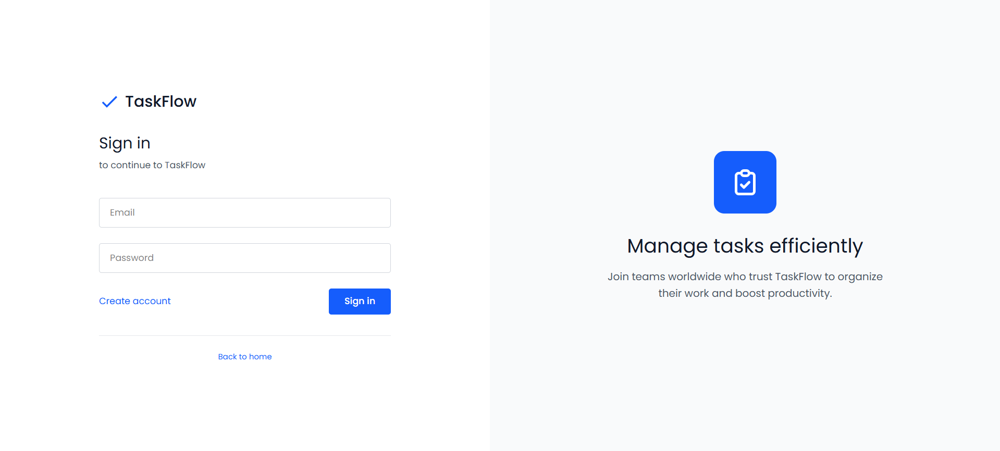
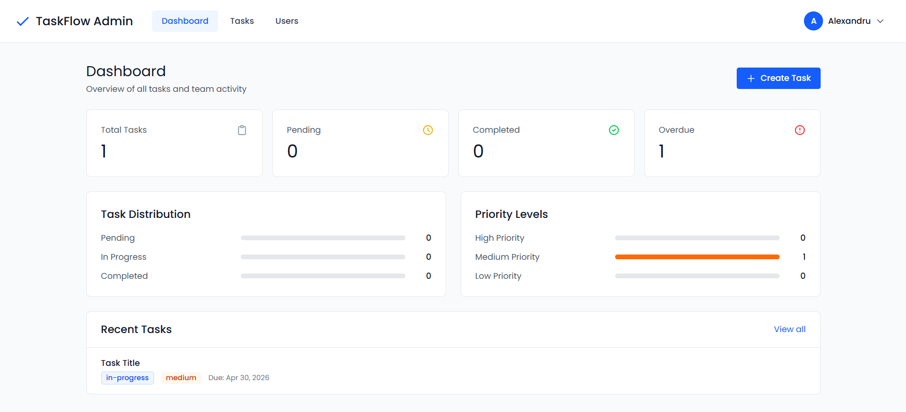
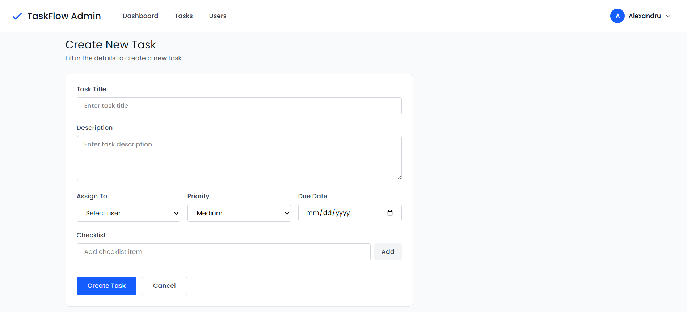

# TaskSprint





A full-stack task management application with role-based access control, featuring an admin dashboard for task and user management, and a user portal for tracking assigned tasks.

## Tech Stack

### Backend
- **Node.js** with **Express.js** - REST API server
- **MongoDB** with **Mongoose** - Database and ODM
- **JWT** (jsonwebtoken) - Authentication and authorization
- **bcryptjs** - Password hashing
- **Multer** - File upload handling
- **ExcelJS** - Report generation
- **CORS** - Cross-origin resource sharing
- **dotenv** - Environment configuration

### Frontend
- **React 19** - UI library
- **Vite** - Build tool and dev server
- **React Router DOM** - Client-side routing
- **Axios** - HTTP client
- **Tailwind CSS 4** - Styling framework
- **Recharts** - Data visualization
- **React Icons** - Icon library
- **React Hot Toast** - Notifications
- **Moment.js** - Date formatting

## Features

- Role-based authentication (Admin/Member)
- Admin dashboard with analytics and charts
- Task management with priorities and status tracking
- Todo checklist within tasks
- User management (admin only)
- File attachments support
- Profile image uploads
- Excel report generation
- Real-time task progress tracking

## API Endpoints

### Authentication (`/api/auth`)

| Method | Endpoint | Access | Description |
|--------|----------|--------|-------------|
| POST | `/register` | Public | Register new user (use adminInviteToken for admin role) |
| POST | `/login` | Public | Login and get JWT token |
| GET | `/profile` | Private | Get current user profile |
| PUT | `/profile/update` | Private | Update user profile |
| POST | `/profile/image` | Private | Upload profile image |

### Tasks (`/api/tasks`)

| Method | Endpoint | Access | Description |
|--------|----------|--------|-------------|
| GET | `/dashboard-data` | Admin | Get admin dashboard statistics |
| GET | `/user-dashboard-data` | Admin | Get user-specific dashboard data |
| GET | `/my-dashboard` | Private | Get current user's dashboard data |
| GET | `/my-tasks` | Private | Get tasks assigned to current user |
| GET | `/` | Admin | Get all tasks |
| GET | `/:id` | Private | Get task by ID |
| POST | `/` | Admin | Create new task |
| PUT | `/:id` | Admin | Update task |
| DELETE | `/:id` | Admin | Delete task |
| PUT | `/:id/status` | Private | Update task status |
| PUT | `/:id/todos` | Private | Update task checklist (auto-updates progress) |

### Users (`/api/users`)

| Method | Endpoint | Access | Description |
|--------|----------|--------|-------------|
| GET | `/` | Admin | Get all users with task statistics |
| GET | `/:id` | Admin | Get user by ID |
| POST | `/` | Admin | Create new user |
| PUT | `/:id` | Admin | Update user |
| DELETE | `/:id` | Admin | Delete user |

### Reports (`/api/reports`)

| Method | Endpoint | Access | Description |
|--------|----------|--------|-------------|
| GET | `/export/reports` | Admin | Export task report as Excel file |
| GET | `/export/users` | Admin | Export user report with task stats as Excel |

## Setup Instructions

### Backend Setup

1. Navigate to the backend directory:
```bash
cd backend
```

2. Install dependencies:
```bash
npm install
```

3. Create a `.env` file with the following variables:
```env
PORT=5000
MONGODB_URI=your_mongodb_connection_string
JWT_SECRET=your_jwt_secret_key
ADMIN_INVITE_TOKEN=your_admin_invite_token
CLIENT_URL=http://localhost:5173
```

4. Start the development server:
```bash
npm run dev
```

### Frontend Setup

1. Navigate to the frontend directory:
```bash
cd frontend
```

2. Install dependencies:
```bash
npm install
```

3. Create a `.env` file based on `.env.example`:
```env
VITE_API_URL=http://localhost:5000
```

4. Start the development server:
```bash
npm run dev
```

## Authentication

The application uses JWT-based authentication. Include the token in the Authorization header:

```
Authorization: Bearer <your_jwt_token>
```

To register as an admin, include the `adminInviteToken` in the registration request body.